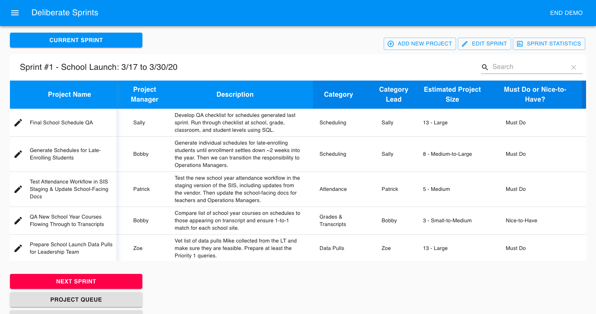

<h1 align="center">
   | Deliberate Sprints
</h1>

<h3 align="center" style="font-weight: bold">
  <a href="https://deliberate-sprints.web.app/" style="text-decoration: none">Live Site</a>
</h3>

  

\
This is a CRUD sprint tracking tool that lets a user organize projects and sprints and monitor their progress over time.

## Technologies

### Core

  * [JavaScript/React](https://reactjs.org/)
  * [Redux](https://redux.js.org/)

### API

  * [Axios](https://github.com/axios/axios)

### Backend / Database

  * [Firebase](https://firebase.google.com/)

### User Interface

  * [Material-UI](https://material-ui.com/)

### Testing

  * [Jest](https://jestjs.io/en/)
  * [Enzyme](https://enzymejs.github.io/enzyme/)
  * [Cypress](https://www.cypress.io/)
  * [Redux-Mock-Store](https://github.com/dmitry-zaets/redux-mock-store)

### Continuous Integration

  * [CircleCI](https://circleci.com/)

### Misc. Features

  * [Recharts](http://recharts.org/en-US/)
  * [Formik](https://jaredpalmer.com/formik/)
  * [Yup](https://github.com/jquense/yup)
  * [Material-Table](https://material-table.com/#/)
  * [React-DateTime](https://github.com/YouCanBookMe/react-datetime)
  * [UUID](https://github.com/uuidjs/uuid)

## Questions?

Feel free to contact Mike at mldunham@gmail.com or visit https://www.mikedunham.org.